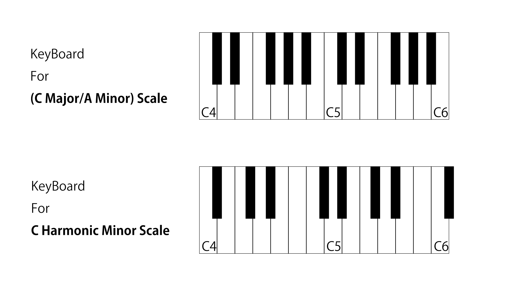
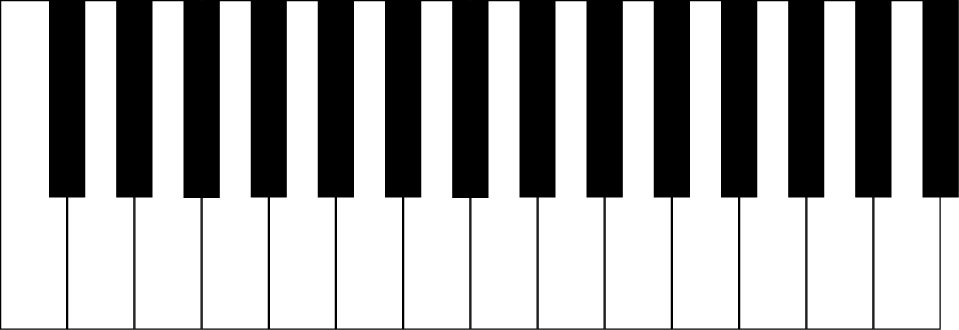

# MIDI keyboard for non-mainstream scales

## Summary

Making the MIDI keyboard for playing with non-mainstream scales

You probably have seen upper one.
It is the keyboard which is most popular in the world.
It was designed for playing C Major Scale Music.
in white keys, frequently used notes are assigned.
in black keys, another notes are assigned.
So, it is hard to play another Scale Music in common keyboard.

I thought that if I could make a keyboard with lots of black keys and make the black keys removable, it would be a keyboard that could be used on any scale.
## Plan

1. Make a design for this keyboard with pencil and paper.
2. Make a 3D model with CAD.
3. Make a program to output MIDI signal and switch scale with arduino.
 - using 8 segment displays, I can check what selected scale is.
## Budget

| Product             | Supplier/Link                                                   | Cost       |
| ------------------- | --------------------------------------------------------------- | ---------- |
| 3D Printer          | https://www.elegoo.com/products/elegoo-neptune-3-fdm-3d-printer | 209.99 USD |
| Arduino Starter Kit | https://www.amazon.co.jp/dp/B06XF2HZGT                          | 5,099 JPY  |
| Mechanical Switch   | Purchase separately                                             | 0          |
| filament            | Purchase separately                                             | 0          |
| Total               | Considering the JPY/USD exchange rate                           | 250.00 USD |